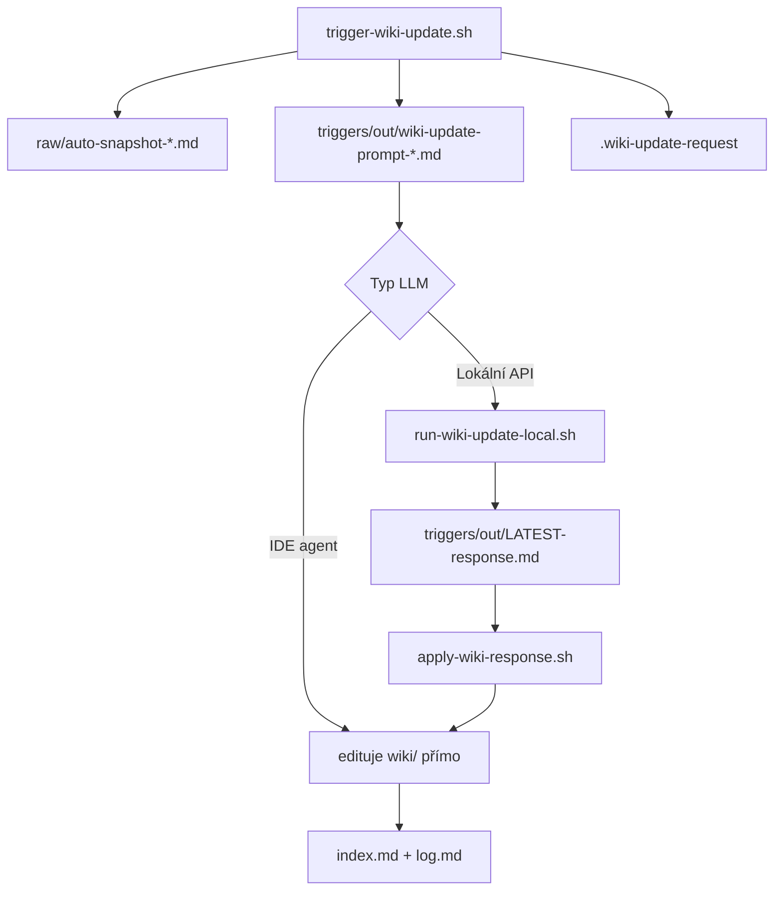

# Wiki triggers

Mechanismus pro **libovolné LLM** — cloud IDE agenty **i lokální modely** (Ollama, LM Studio, vLLM, LiteLLM, Open WebUI).

## Dva režimy použití

### A) Agent s přístupem k souborům (Cursor, Claude Code, Aider, Continue…)

```bash
task wiki:update
# → LLM čte repo, edituje wiki/ přímo
```

### B) Lokální model bez file tools (Ollama CLI, LM Studio chat, Open WebUI…)

Lokální model **nevidí disk** → dostane **prompt bundle** (vše v jednom souboru) a vrátí `<wiki-file>` bloky.

```bash
task wiki:update                    # snapshot + bundle
cp triggers/local-models.env.example triggers/local-models.env
# uprav URL + model
task wiki:run-local                 # API call → triggers/out/LATEST-response.md
task wiki:apply                     # zapíše wiki/*.md z odpovědi
```

Nebo jedním příkazem: `task wiki:local`

## Jak to funguje



| Soubor | Účel |
|--------|------|
| `triggers/out/wiki-update-prompt-*.md` | Self-contained prompt (všechny wiki stránky + snapshot) |
| `triggers/local-models.env` | `WIKI_LLM_BASE_URL`, `WIKI_LLM_MODEL` (gitignored) |
| `scripts/run-wiki-update-local.sh` | OpenAI-compatible `/v1/chat/completions` |
| `scripts/apply-wiki-response.sh` | Parsuje `<wiki-file path="…">` → disk |

## Podporované lokální stacky

| Stack | `WIKI_LLM_BASE_URL` | Poznámka |
|-------|---------------------|----------|
| **Ollama** | `http://127.0.0.1:11434/v1` | Default, `ollama serve` |
| **LM Studio** | `http://127.0.0.1:1234/v1` | Local Server tab |
| **LiteLLM** | `http://<host>:4000/v1` | Bakery `llm-gateway` |
| **Open WebUI** | stejné jako backend | Vlož bundle ručně nebo přes API |
| **vLLM / TGW** | `http://127.0.0.1:8000/v1` | OpenAI compatible |

## Open WebUI (ručně)

1. `task wiki:bundle`
2. Otevři `triggers/out/LATEST-prompt.md`, zkopíruj do chatu
3. Ulož odpověď do souboru
4. `./scripts/apply-wiki-response.sh odpoved.md`

## Env

- `BAKERY_WORKSPACE` — sibling repos pro snapshot
- `WIKI_LLM_*` — viz `triggers/local-models.env.example`

## Výstupní formát (pro lokální model)

```xml
<wiki-file path="wiki/overview.md">
---
title: Přehled platformy
...
</wiki-file>
```

Lokální model **musí** vracet celé soubory v tomto formátu — `apply-wiki-response.sh` je zapíše.
